# Accessibility Audit Tool - Pipeline Documentation

This document describes the complete audit pipeline from URL input to final HTML report.

## High-Level Pipeline Overview

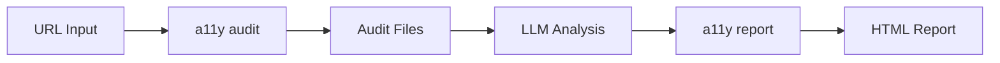

## Complete Pipeline Diagram

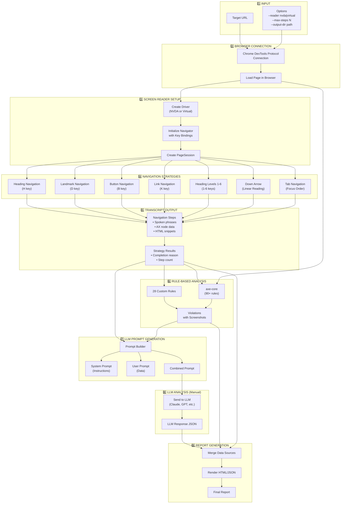

## Stage-by-Stage Breakdown

### Stage 1: Input

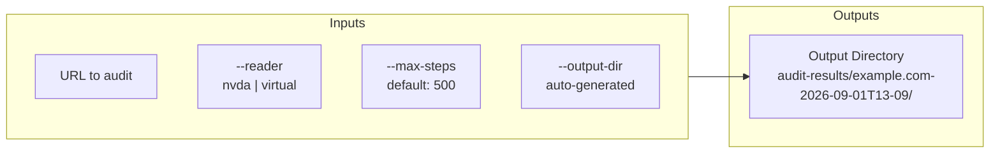

**Command:** `a11y audit <url> [options]`

| Input          | Description            | Default        |
| -------------- | ---------------------- | -------------- |
| `url`          | Target URL to audit    | Required       |
| `--reader`     | Screen reader driver   | `nvda`         |
| `--max-steps`  | Max steps per strategy | `500`          |
| `--output-dir` | Output directory       | Auto-generated |

---

### Stage 2: Browser Connection

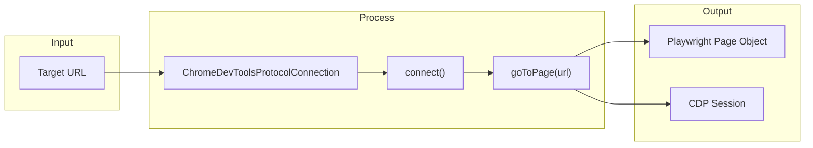

The tool connects to Chrome via the DevTools Protocol, enabling:

- Page navigation and control
- Accessibility tree inspection
- DOM queries for HTML snippets
- Screenshot capture

---

### Stage 3: Screen Reader Setup

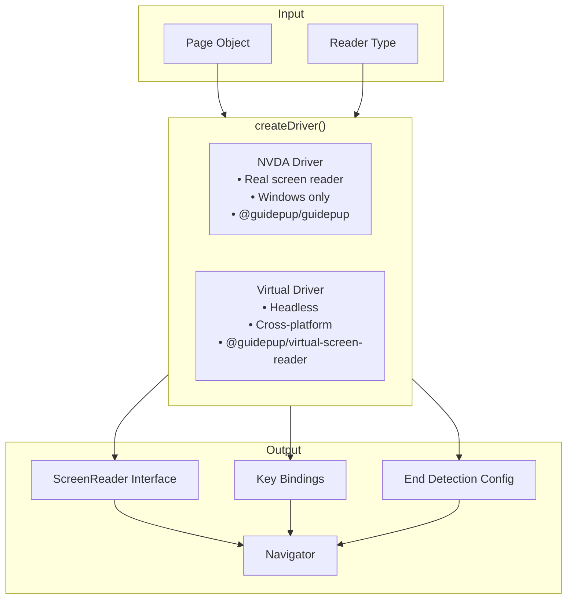

**Driver Capabilities:**

| Driver  | Platform | Real SR      | Speed  |
| ------- | -------- | ------------ | ------ |
| NVDA    | Windows  | ✅ Yes       | Slower |
| Virtual | Any      | ❌ Simulated | Faster |

---

### Stage 4: Navigation Strategies

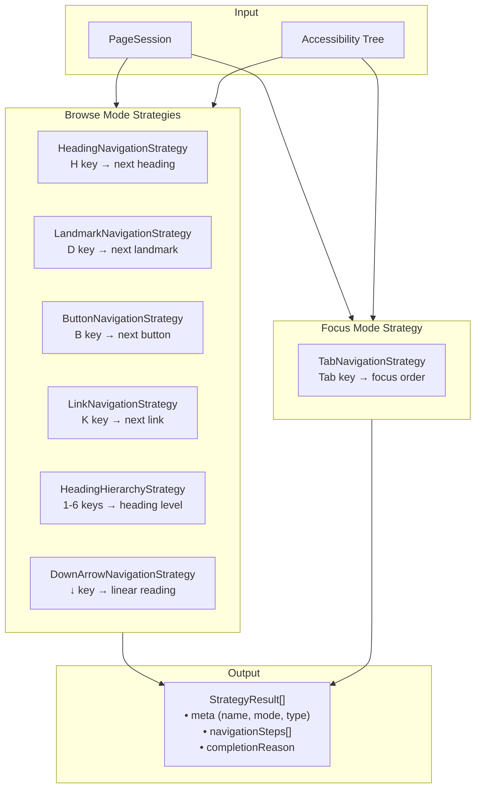

**Execution Order:**

1. Headings (H key) - max 100 steps
2. Landmarks (D key) - max 100 steps
3. Buttons (B key) - max 100 steps
4. Links (K key) - max 500 steps
5. Heading levels 1-6 - max 500 steps each
6. Down arrow (linear) - max 1000 steps
7. Tab (focus order) - max 500 steps

**Completion Reasons:**

- `exhausted` - No more elements found
- `limit-reached` - Hit max steps
- `cycle-complete` - Returned to start (Tab)
- `trapped` - Focus trap detected

---

### Stage 5: Transcript Generation

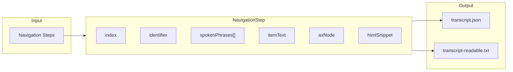

**NavigationStep Structure:**

```json
{
    "index": 0,
    "identifier": "main-heading",
    "spokenPhrases": ["Products", "heading level 1"],
    "itemText": "Products",
    "axNode": {
        "role": { "value": "heading" },
        "name": { "value": "Products" },
        "level": { "value": 1 }
    },
    "htmlSnippet": "<h1 id=\"main-heading\">Products</h1>"
}
```

---

### Stage 6: Rule-Based Analysis

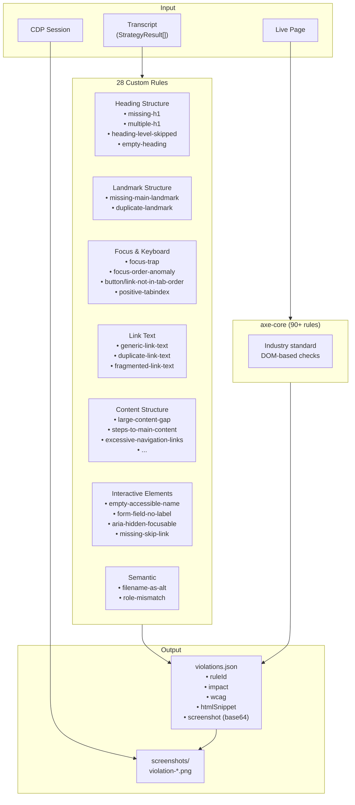

**Violation Structure:**

```json
{
    "ruleId": "focus-trap",
    "impact": "critical",
    "wcag": ["2.1.2"],
    "message": "Focus trap detected in modal dialog",
    "htmlSnippet": "<div class=\"modal\">...</div>",
    "context": {
        "strategy": "tab",
        "stepIndex": 45,
        "screenshot": "data:image/png;base64,..."
    }
}
```

---

### Stage 7: LLM Prompt Generation

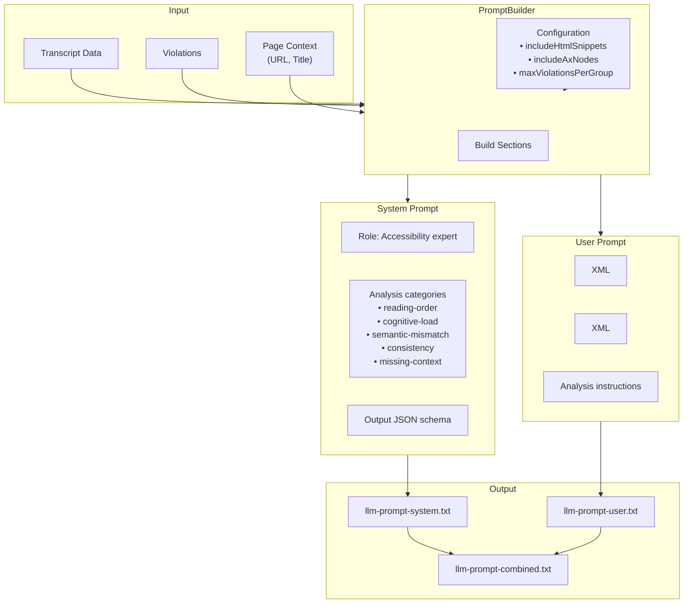

**Prompt Files:**

| File                      | Purpose                         | Size     |
| ------------------------- | ------------------------------- | -------- |
| `llm-prompt-system.txt`   | Instructions and schema         | ~3KB     |
| `llm-prompt-user.txt`     | Transcript + violations data    | Variable |
| `llm-prompt-combined.txt` | Full prompt for chat interfaces | Combined |

---

### Stage 8: LLM Analysis (Manual Step)

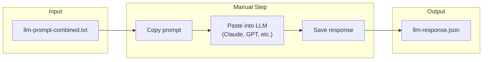

**Expected LLM Response Schema:**

```json
{
  "summary": {
    "overallAssessment": "needs-review",
    "keyIssues": ["Focus trap in modal", "..."],
    "positiveAspects": ["Good heading structure"]
  },
  "findings": [
    {
      "category": "reading-order",
      "title": "Footer announced before main content",
      "severity": "serious",
      "confidence": "high",
      "evidence": { "steps": [...] },
      "recommendation": "Move footer landmark after main"
    }
  ],
  "violationEnhancements": [
    {
      "ruleId": "focus-trap",
      "assessment": "confirmed",
      "reasoning": "Modal has no escape route"
    }
  ]
}
```

---

### Stage 9: Report Generation

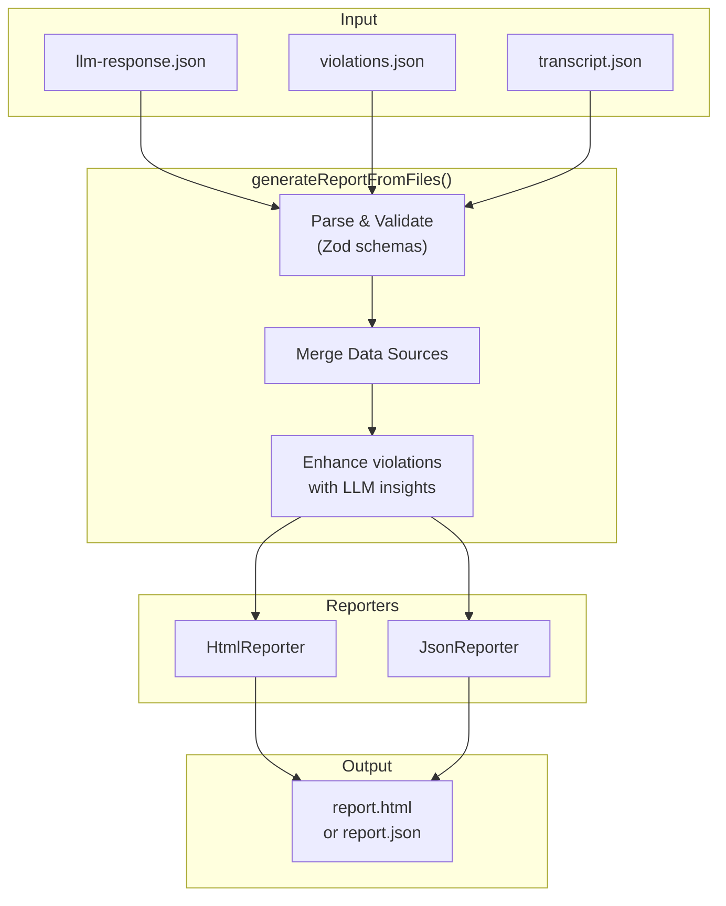

**Command:** `a11y report --dir <audit-dir>`

**HTML Report Sections:**

1. **Summary** - Overall assessment, key issues
2. **LLM Findings** - Semantic analysis results
3. **Rule Violations** - Grouped by impact
4. **Screenshots** - Embedded violation screenshots
5. **Transcript** - Collapsible navigation logs

---

## Output Files Summary

```
audit-results/example.com-2026-09-01T13-09/
├── violations.json          # Rule-detected violations
├── transcript.json          # Raw navigation data
├── transcript-readable.txt  # Human-readable transcript
├── llm-prompt-system.txt    # System prompt for LLM
├── llm-prompt-user.txt      # User prompt with data
├── llm-prompt-combined.txt  # Full prompt for chat
├── screenshots/             # Violation screenshots
│   ├── focus-trap-001.png
│   └── ...
├── llm-response.json        # (User adds after LLM analysis)
└── report.html              # (Generated by a11y report)
```

---

## Data Flow Diagram

```mermaid
flowchart TB
    subgraph Stage1["CLI Input"]
        A1[URL + Options]
    end

    subgraph Stage2["Browser"]
        A2[Page Object]
    end

    subgraph Stage3["Screen Reader"]
        A3[Navigator + Driver]
    end

    subgraph Stage4["Navigation"]
        A4[12 Strategies Execute]
    end

    subgraph Stage5["Transcript"]
        A5[transcript.json<br/>StrategyResult[]]
    end

    subgraph Stage6["Analysis"]
        A6[violations.json<br/>Violation[]]
    end

    subgraph Stage7["Prompts"]
        A7[llm-prompt-*.txt]
    end

    subgraph Stage8["LLM"]
        A8[llm-response.json]
    end

    subgraph Stage9["Report"]
        A9[report.html]
    end

    A1 --> A2 --> A3 --> A4 --> A5
    A5 --> A6
    A2 --> A6
    A5 --> A7
    A6 --> A7
    A7 -.->|manual| A8
    A5 --> A9
    A6 --> A9
    A8 --> A9
```

---

## Key Interfaces

### StrategyResult

```typescript
interface StrategyResult {
    meta: {
        name: string; // e.g., "heading", "tab"
        description: string;
        mode: 'browse' | 'focus';
        type?: string; // e.g., "heading", "tab"
    };
    navigationSteps: NavigationStep[];
    completionReason: {
        kind: 'exhausted' | 'limit-reached' | 'cycle-complete' | 'trapped';
        detail: string;
    };
}
```

### Violation

```typescript
interface Violation {
    ruleId: string;
    impact: 'critical' | 'serious' | 'moderate' | 'minor';
    wcag: string[];
    message: string;
    htmlSnippet?: string;
    context?: {
        strategy?: string;
        stepIndex?: number;
        screenshot?: string; // base64 or file path
    };
}
```

### ReportData

```typescript
interface ReportData {
    analysis: LlmCompleteResponse; // Parsed LLM response
    violations: Violation[]; // Rule violations
    transcript?: StrategyResult[]; // Navigation data
    meta: {
        timestamp: number;
        duration?: number;
        strategies?: string[];
    };
}
```
