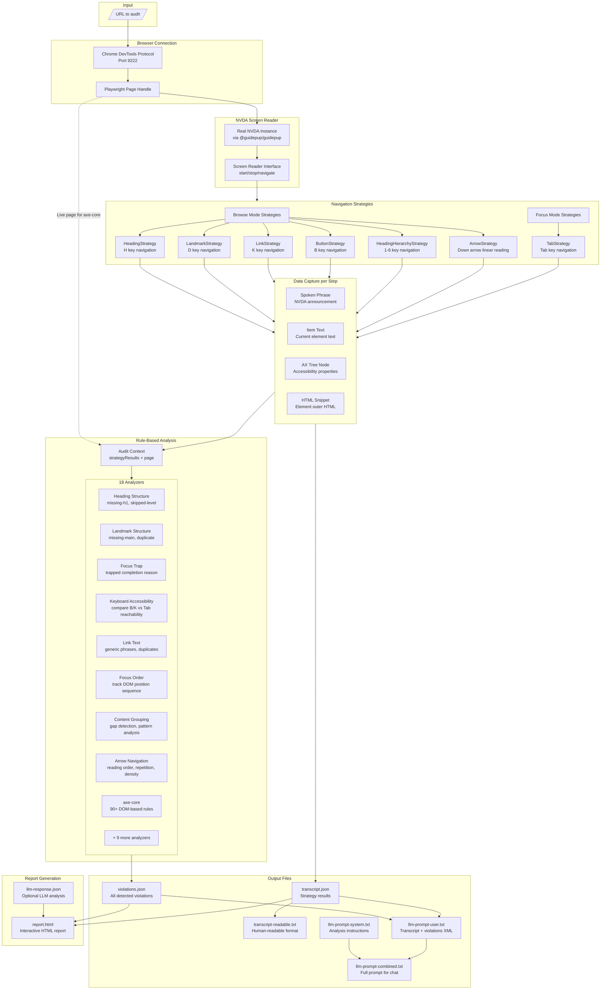

# Accessibility Audit Tool - Architecture

## System Overview



## Data Flow Stages

### Stage 1: Browser Connection

**Input:** URL string  
**Output:** Playwright Page handle

```
ChromeDevToolsProtocolConnection.connect()
  → Connects to Chrome on port 9222 via CDP
  → Returns Browser instance

ChromeDevToolsProtocolConnection.goToPage(url)
  → Finds existing tab or creates new one
  → Returns Playwright Page handle
```

### Stage 2: Screen Reader Session

**Input:** Page handle, NVDA instance, Navigation strategies  
**Output:** Accessibility tree, Strategy results

```
PageSession.startSession()
  → Creates CDP session for accessibility tree access
  → Brings Chrome window to foreground (Win32 API)
  → Starts NVDA via @guidepup/guidepup

PageSession.run()
  → Fetches full accessibility tree via CDP
  → Executes each strategy sequentially
  → Returns { axTree, html, page, results, url }
```

### Stage 3: Navigation Strategy Execution

**Input:** NavigationContext (screen reader + accessibility tree)  
**Output:** StrategyResult (steps + completion reason)

Each strategy:

1. Iterates using NVDA navigation commands (H, D, K, B, 1-6, Tab, Arrow)
2. Captures spoken phrase and item text per step
3. Matches to accessibility tree node using AxTreeCursor
4. Retrieves HTML snippet via CDP DOM.getOuterHTML
5. Detects completion: exhausted, cycle-complete, trapped, or limit-reached

**Navigation Step Structure:**

```typescript
{
  index: number,
  identifier: UUID,
  spokenPhrases: string[],    // What NVDA announced
  itemText: string,           // Current element text
  axNode: AXNode | undefined, // Accessibility tree node
  htmlSnippet: string | null  // Element HTML
}
```

**Completion Reasons:**

- `exhausted` - No more elements of type (e.g., "no next heading")
- `cycle-complete` - Tab returned to first element
- `trapped` - Same element focused 3+ consecutive times
- `limit-reached` - Hit maxSteps safety limit

### Stage 4: Rule-Based Analysis

**Input:** AuditContext (strategyResults + live page)  
**Output:** Violation[] with WCAG mappings

Each analyzer receives the same context and returns violations:

| Analyzer               | Algorithm                                                | Rules                                                                                                    |
| ---------------------- | -------------------------------------------------------- | -------------------------------------------------------------------------------------------------------- |
| Heading Structure      | Parse heading levels from AX nodes, check sequence gaps  | missing-h1, multiple-h1, heading-level-skipped, empty-heading                                            |
| Landmark Structure     | Count landmark types, check for unique names             | missing-main-landmark, duplicate-landmark                                                                |
| Focus Trap             | Check TabStrategy completion reason for `trapped`        | focus-trap                                                                                               |
| Keyboard Accessibility | Compare ButtonStrategy items vs TabStrategy items        | button-not-in-tab-order, link-not-in-tab-order                                                           |
| Link Text              | Pattern match against generic phrases, group by text     | generic-link-text, duplicate-link-text                                                                   |
| Focus Order            | Track DOM positions, detect backwards jumps              | focus-order-anomaly, positive-tabindex                                                                   |
| Content Grouping       | Measure steps between headings, count items per landmark | large-content-gap, landmark-without-heading                                                              |
| Arrow Navigation       | Analyze linear reading sequence                          | steps-to-main-content, reading-order-landmark-sequence, excessive-repetition, content-density-per-region |
| axe-core               | Run axe-core against live Playwright page                | 90+ DOM-based rules                                                                                      |

**Violation Structure:**

```typescript
{
  id: string,
  ruleId: string,           // e.g., "focus-trap"
  wcag: { primary, related }, // WCAG criterion mapping
  impact: "critical" | "serious" | "moderate" | "minor",
  message: string,
  element: { htmlSnippet?, selector? },
  tool: "nvda-audit" | "axe-core",
  toolDetails: NvdaToolDetails | AxeToolDetails
}
```

### Stage 5: LLM Prompt Generation

**Input:** Strategy results, Violations, Page context  
**Output:** System prompt, User prompt, Combined prompt

```
AccessibilityPromptBuilder
  .withPage(page)           // Extract URL and title
  .withStrategyResults()    // Build transcript XML
  .withViolations()         // Build violations XML
  .build()                  // Generate prompts
```

**System Prompt Contains:**

- Role definition (accessibility expert)
- Analysis categories (reading order, cognitive load, semantic mismatch, etc.)
- Image analysis guidance for "graphic" announcements
- Content grouping judgment criteria
- Output JSON schema (Zod-validated)

**User Prompt Contains:**

- Transcript XML with navigation steps per strategy
- Violations XML grouped by rule
- Page context (URL, title)

### Stage 6: Report Generation

**Input:** violations.json, transcript.json, llm-response.json (optional)  
**Output:** report.html

```
generateReportFromFiles()
  → Reads and validates input files
  → Parses LLM response with Zod schema
  → Generates HTML with:
     - Summary statistics
     - Violation cards by severity
     - LLM findings (if provided)
     - Navigation transcript
```

## Key Algorithms

### AxTreeCursor - Element Matching

Matches NVDA-announced text to accessibility tree nodes:

```
matchNext(text, expectedRole?)
  → Advances cursor through AX tree
  → Compares node name/value against spoken text
  → Returns matched node or null

findByBackendDOMNodeId(id)
  → Direct lookup for Tab navigation
  → Returns node at specific DOM position
```

### Focus Trap Detection

```
TabNavigationStrategy.execute()
  → Track lastBackendNodeId
  → If same node focused 3 consecutive times:
     → Return completionReason: 'trapped'
  → If backendNodeId becomes null after being set:
     → Return completionReason: 'cycle-complete'
```

### Keyboard Accessibility Comparison

```
analyzeKeyboardAccessibility()
  → Collect all items from ButtonStrategy (B key)
  → Collect all items from TabStrategy (Tab key)
  → Items reachable by B but not Tab = button-not-in-tab-order
  → Same for LinkStrategy (K key) vs Tab
```

### Content Gap Analysis

```
analyzeContentGrouping()
  → Walk ArrowStrategy steps linearly
  → Count steps since last heading
  → If gap > threshold (default 15):
     → Create large-content-gap violation
  → Track items per landmark
  → If landmark has many items but no heading:
     → Create landmark-without-heading violation
```

## File Structure

```
src/
├── run-audit.ts              # CLI entry point for auditing
├── generate-report.ts        # CLI entry point for reports
├── chrome-dev-tools-protocol-connection.ts
├── screen-reader/
│   ├── nvda-screen-reader.ts # NVDA-specific implementation
│   ├── screen-reader.ts      # Base class with iterators
│   ├── page-session.ts       # Orchestrates audit session
│   ├── accessibility-tree/
│   │   ├── ax-tree-cursor.ts # Element matching
│   │   └── ax-tree-util.ts   # CDP helpers
│   └── navigation-strategy/
│       ├── browse-mode-strategies/
│       │   ├── heading-navigation-strategy.ts
│       │   ├── landmark-navigation-strategy.ts
│       │   ├── link-navigation-strategy.ts
│       │   ├── button-navigation-strategy.ts
│       │   ├── heading-hierarchy-navigation-strategy.ts
│       │   └── arrow-navigation-strategy.ts
│       └── focus-mode-strategies/
│           └── tab-navigation-strategy.ts
├── analysis/
│   ├── registry.ts           # Check registration and execution
│   ├── rule-catalog.ts       # WCAG mappings, single source of truth
│   ├── context.ts            # AuditContext type
│   ├── violation.ts          # Violation type
│   └── analyzers/
│       ├── heading-structure.ts
│       ├── landmark-structure.ts
│       ├── focus-trap.ts
│       ├── keyboard-accessibility.ts
│       ├── link-text.ts
│       ├── focus-order.ts
│       ├── content-grouping.ts
│       ├── arrow-navigation.ts
│       ├── axe-core.ts
│       └── ... (18 total)
├── llm/
│   └── prompt-builder/
│       ├── schemas.ts        # Zod schemas for LLM I/O
│       └── sections/
│           ├── accessibility-prompt-builder.ts
│           ├── transcript-section.ts
│           └── violations-section.ts
└── reporting/
    ├── reporter.ts           # Reporter interface
    ├── from-files.ts         # File-based report generation
    └── reporters/
        ├── html-reporter.ts
        └── json-reporter.ts
```
