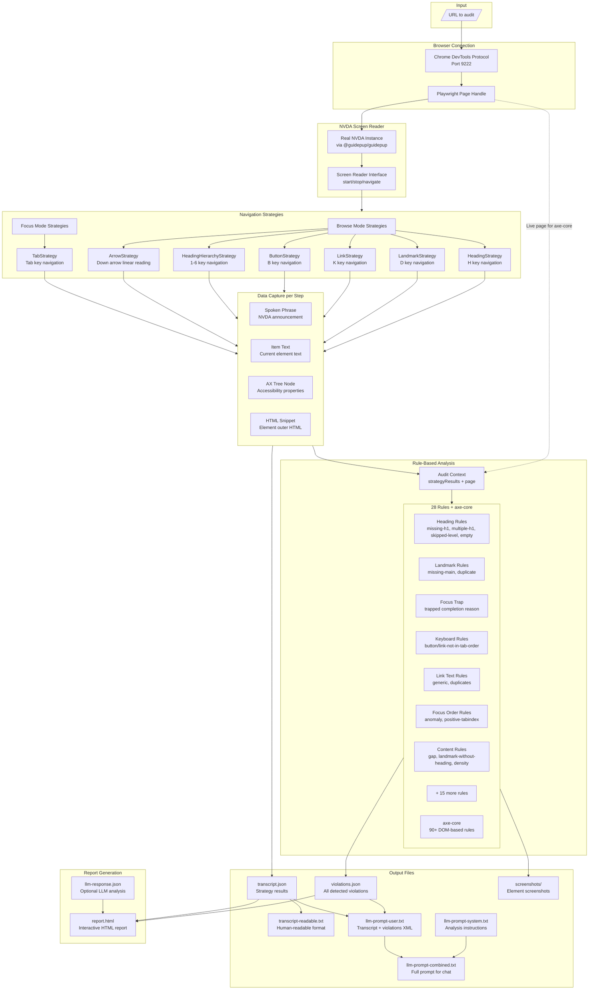

# Accessibility Audit Tool - Architecture

## System Overview



## Data Flow Stages

### Stage 1: Browser Connection

**Input:** URL string  
**Output:** Playwright Page handle

```
ChromeDevToolsProtocolConnection.connect()
  → Connects to Chrome on port 9222 via CDP
  → Returns Browser instance

ChromeDevToolsProtocolConnection.goToPage(url)
  → Finds existing tab or creates new one
  → Returns Playwright Page handle
```

### Stage 2: Screen Reader Session

**Input:** Page handle, NVDA instance, Navigation strategies  
**Output:** Accessibility tree, Strategy results

```
PageSession.startSession()
  → Creates CDP session for accessibility tree access
  → Brings Chrome window to foreground (Win32 API)
  → Starts NVDA via @guidepup/guidepup

PageSession.run()
  → Fetches full accessibility tree via CDP
  → Executes each strategy sequentially
  → Returns { axTree, html, page, results, url }
```

### Stage 3: Navigation Strategy Execution

**Input:** NavigationContext (screen reader + accessibility tree)  
**Output:** StrategyResult (steps + completion reason)

Each strategy:

1. Iterates using NVDA navigation commands (H, D, K, B, 1-6, Tab, Arrow)
2. Captures spoken phrase and item text per step
3. Matches to accessibility tree node using AxTreeCursor
4. Retrieves HTML snippet via CDP DOM.getOuterHTML
5. Detects completion: exhausted, cycle-complete, trapped, or limit-reached

**Navigation Step Structure:**

```typescript
{
  index: number,
  identifier: UUID,
  spokenPhrases: string[],    // What NVDA announced
  itemText: string,           // Current element text
  axNode: AXNode | undefined, // Accessibility tree node
  htmlSnippet: string | null  // Element HTML
}
```

**Completion Reasons:**

- `exhausted` - No more elements of type (e.g., "no next heading")
- `cycle-complete` - Tab returned to first element
- `trapped` - Same element focused 3+ consecutive times
- `limit-reached` - Hit maxSteps safety limit

### Stage 4: Rule-Based Analysis

**Input:** AuditContext (strategyResults + live page + CDP session)  
**Output:** Violation[] with WCAG mappings

Each rule receives the same context and returns violations. Rules are defined in `src/analysis/rules/rule-catalog.ts` which serves as the single source of truth for WCAG mappings and impact levels.

**Rule Categories:**

| Category               | Rules                                                                               | Detection Method                                     |
| ---------------------- | ----------------------------------------------------------------------------------- | ---------------------------------------------------- |
| Heading Structure      | `missing-h1`, `multiple-h1`, `heading-level-skipped`, `empty-heading`               | Parse heading levels from AX nodes, check sequence   |
| Landmark Structure     | `missing-main-landmark`, `duplicate-landmark`                                       | Count landmark types, check for unique names         |
| Focus & Keyboard       | `focus-trap`, `focus-order-anomaly`, `positive-tabindex`                            | Analyze TabStrategy completion and sequence          |
| Keyboard Accessibility | `button-not-in-tab-order`, `link-not-in-tab-order`                                  | Compare B/K strategy items vs Tab strategy items     |
| Link Text              | `generic-link-text`, `duplicate-link-text`                                          | Pattern match against generic phrases, group by text |
| Content Structure      | `large-content-gap`, `landmark-without-heading`, `repeated-pattern-without-heading` | Measure steps between headings, count items          |
| Reading Experience     | `steps-to-main-content`, `reading-order-landmark-sequence`, `excessive-repetition`  | Analyze ArrowStrategy linear reading sequence        |
| Navigation Complexity  | `excessive-navigation-links`, `content-density-per-region`                          | Count items per region/landmark                      |
| Interactive Elements   | `empty-accessible-name`, `aria-hidden-focusable`, `form-field-no-label`             | Check AX node properties for missing/invalid names   |
| Semantic               | `filename-as-alt`, `role-mismatch`, `missing-skip-link`                             | Pattern recognition and role validation              |
| axe-core               | 90+ DOM-based rules                                                                 | Run axe-core against live Playwright page            |

**Violation Structure:**

```typescript
{
  id: string,
  rule: {
    id: string,             // e.g., "focus-trap"
    summary: string,
    wcag: { primary, related },
    impact: "critical" | "serious" | "moderate" | "minor"
  },
  message: string,
  htmlSnippet?: string,
  selector?: string,
  tool: "nvda-audit" | "axe-core",
  toolDetails: NvdaContext | AxeContext,
  screenshot?: { path, width, height } | { error, backendNodeId }
}
```

### Stage 5: LLM Prompt Generation

**Input:** Strategy results, Violations, Page context  
**Output:** System prompt, User prompt, Combined prompt

```
createPromptBuilder(options)
  .withPage(page)           // Extract URL and title
  .withStrategyResults()    // Build transcript XML
  .withViolations()         // Build violations XML
  .build()                  // Generate prompts
```

**System Prompt Contains:**

- Role definition (accessibility expert)
- Analysis categories (reading order, cognitive load, semantic mismatch, etc.)
- Image analysis guidance for "graphic" announcements
- Content grouping judgment criteria
- Output JSON schema (Zod-validated)

**User Prompt Contains:**

- Transcript XML with navigation steps per strategy
- Violations XML grouped by rule
- Page context (URL, title)

### Stage 6: Report Generation

**Input:** violations.json, transcript.json, llm-response.json (optional)  
**Output:** report.html

```
generateReportFromFiles()
  → Reads and validates input files
  → Parses LLM response with Zod schema
  → Generates HTML with:
     - Summary statistics
     - Violation cards by severity
     - LLM findings (if provided)
     - Navigation transcript
```

## Key Algorithms

### AxTreeCursor - Element Matching

Matches NVDA-announced text to accessibility tree nodes:

```
matchNext(text, expectedRole?)
  → Advances cursor through AX tree
  → Compares node name/value against spoken text
  → Returns matched node or null

findByBackendDOMNodeId(id)
  → Direct lookup for Tab navigation
  → Returns node at specific DOM position
```

### Focus Trap Detection

```
TabNavigationStrategy.execute()
  → Track lastBackendNodeId
  → If same node focused 3 consecutive times:
     → Return completionReason: 'trapped'
  → If backendNodeId becomes null after being set:
     → Return completionReason: 'cycle-complete'
```

### Keyboard Accessibility Comparison

```
button-not-in-tab-order rule:
  → Collect all items from ButtonStrategy (B key)
  → Collect all items from TabStrategy (Tab key)
  → Items reachable by B but not Tab = violation

link-not-in-tab-order rule:
  → Same for LinkStrategy (K key) vs Tab
```

### Content Gap Analysis

```
large-content-gap rule:
  → Walk ArrowStrategy steps linearly
  → Count steps since last heading
  → If gap > threshold (default 15):
     → Create violation

landmark-without-heading rule:
  → Track items per landmark
  → If landmark has many items but no heading:
     → Create violation
```

### Screenshot Capture

```
captureScreenshotToFile()
  → Scroll element into view via CDP
  → Get bounding box via DOM.getBoxModel
  → Highlight element with colored border
  → Capture clipped screenshot
  → Save to screenshots/ directory
  → Return path or error details
```

## File Structure

```
src/
├── run-audit.ts                    # CLI entry point for auditing
├── generate-report.ts              # CLI entry point for reports
├── index.ts                        # Library exports
├── lib.ts                          # Shared utilities
├── global.d.ts                     # TypeScript global declarations
├── chrome-dev-tools-protocol-connection.ts
│
├── screen-reader/
│   ├── nvda-screen-reader.ts       # NVDA-specific implementation
│   ├── screen-reader.ts            # Base class with iterators
│   ├── page-session.ts             # Orchestrates audit session
│   ├── accessibility-tree/
│   │   ├── ax-tree-cursor.ts       # Element matching
│   │   └── ax-tree-util.ts         # CDP helpers
│   └── navigation-strategy/
│       ├── browse-mode-strategies/
│       │   ├── navigation-strategy.ts        # Base interface
│       │   ├── heading-navigation-strategy.ts
│       │   ├── landmark-navigation-strategy.ts
│       │   ├── link-navigation-strategy.ts
│       │   ├── button-navigation-strategy.ts
│       │   ├── heading-hierarchy-navigation-strategy.ts
│       │   └── arrow-navigation-strategy.ts
│       └── focus-mode-strategies/
│           └── tab-navigation-strategy.ts
│
├── analysis/
│   ├── index.ts                    # Public exports
│   ├── core/
│   │   ├── context.ts              # AuditContext type
│   │   ├── rule.ts                 # Rule interface
│   │   └── violation.ts            # Violation types
│   ├── rules/
│   │   ├── rule-catalog.ts         # WCAG mappings (single source of truth)
│   │   ├── runner.ts               # Rule execution
│   │   ├── test-fixtures.ts        # Shared test utilities
│   │   ├── utils/
│   │   │   ├── heading-utils.ts
│   │   │   ├── landmark-utils.ts
│   │   │   └── link-utils.ts
│   │   ├── heading-structure/      # Heading hierarchy rules
│   │   │   ├── missing-h1/
│   │   │   ├── multiple-h1/
│   │   │   ├── heading-level-skipped/
│   │   │   └── empty-heading/
│   │   ├── landmark-structure/     # ARIA landmark rules
│   │   │   ├── missing-main-landmark/
│   │   │   └── duplicate-landmark/
│   │   ├── focus-and-keyboard/     # Keyboard navigation rules
│   │   │   ├── focus-trap/
│   │   │   ├── focus-order-anomaly/
│   │   │   ├── positive-tabindex/
│   │   │   ├── button-not-in-tab-order/
│   │   │   └── link-not-in-tab-order/
│   │   ├── link-text/              # Link text quality rules
│   │   │   ├── generic-link-text/
│   │   │   └── duplicate-link-text/
│   │   ├── content-structure/      # Content organization rules
│   │   │   ├── large-content-gap/
│   │   │   ├── landmark-without-heading/
│   │   │   ├── repeated-pattern-without-heading/
│   │   │   ├── steps-to-main-content/
│   │   │   ├── reading-order-landmark-sequence/
│   │   │   ├── excessive-repetition/
│   │   │   ├── excessive-navigation-links/
│   │   │   └── content-density-per-region/
│   │   ├── interactive-elements/   # Interactive element rules
│   │   │   ├── empty-accessible-name/
│   │   │   ├── aria-hidden-focusable/
│   │   │   ├── form-field-no-label/
│   │   │   └── missing-skip-link/
│   │   ├── semantic/               # Semantic correctness rules
│   │   │   ├── filename-as-alt/
│   │   │   └── role-mismatch/
│   │   └── axe-core/               # axe-core integration
│   └── utils/
│       ├── screenshot-capture.ts   # Element screenshot utility
│       ├── string-utils.ts
│       ├── summarize-violations.ts
│       ├── tab-order-helpers.ts
│       └── tool-details.ts
│
├── llm/
│   ├── index.ts
│   └── prompt-builder/
│       ├── index.ts
│       ├── schemas.ts              # Zod schemas for LLM I/O
│       └── sections/
│           ├── accessibility-prompt-builder.ts
│           ├── transcript-section.ts
│           └── violations-section.ts
│
└── reporting/
    ├── index.ts
    ├── reporter.ts                 # Reporter interface
    ├── from-files.ts               # File-based report generation
    ├── transcript-text-formatter.ts
    └── reporters/
        ├── html-reporter.ts
        └── json-reporter.ts
```

## Rule Catalog

All 27 custom rules are defined in `src/analysis/rules/rule-catalog.ts`:

| Rule ID                            | WCAG    | Impact   | axe-core Equivalent                             |
| ---------------------------------- | ------- | -------- | ----------------------------------------------- |
| `empty-accessible-name`            | 4.1.2 A | serious  | `button-name`, `link-name`, `aria-command-name` |
| `missing-h1`                       | 1.3.1 A | serious  | `page-has-heading-one`                          |
| `multiple-h1`                      | 1.3.1 A | moderate | -                                               |
| `heading-level-skipped`            | 1.3.1 A | moderate | `heading-order`                                 |
| `empty-heading`                    | 1.3.1 A | serious  | `empty-heading`                                 |
| `missing-main-landmark`            | 1.3.1 A | serious  | `landmark-one-main`                             |
| `duplicate-landmark`               | 1.3.1 A | moderate | `landmark-unique`                               |
| `generic-link-text`                | 2.4.4 A | serious  | -                                               |
| `duplicate-link-text`              | 2.4.4 A | moderate | `identical-links-same-purpose`                  |
| `focus-trap`                       | 2.1.2 A | critical | -                                               |
| `button-not-in-tab-order`          | 2.1.1 A | serious  | -                                               |
| `link-not-in-tab-order`            | 2.1.1 A | serious  | -                                               |
| `filename-as-alt`                  | 1.1.1 A | serious  | -                                               |
| `role-mismatch`                    | 4.1.2 A | moderate | `aria-allowed-role`                             |
| `focus-order-anomaly`              | 2.4.3 A | serious  | -                                               |
| `positive-tabindex`                | 2.4.3 A | serious  | `tabindex`                                      |
| `missing-skip-link`                | 2.4.1 A | serious  | `bypass`, `skip-link`                           |
| `form-field-no-label`              | 3.3.2 A | critical | `label`, `aria-input-field-name`                |
| `aria-hidden-focusable`            | 4.1.2 A | critical | `aria-hidden-focus`                             |
| `excessive-navigation-links`       | 2.4.1 A | moderate | -                                               |
| `large-content-gap`                | 1.3.1 A | moderate | -                                               |
| `landmark-without-heading`         | 1.3.1 A | moderate | -                                               |
| `repeated-pattern-without-heading` | 1.3.1 A | minor    | -                                               |
| `steps-to-main-content`            | 2.4.1 A | moderate | -                                               |
| `reading-order-landmark-sequence`  | 1.3.2 A | serious  | -                                               |
| `excessive-repetition`             | 1.3.1 A | minor    | -                                               |
| `content-density-per-region`       | 2.4.1 A | moderate | -                                               |

Plus **axe-core** provides 90+ additional DOM-based rules.
